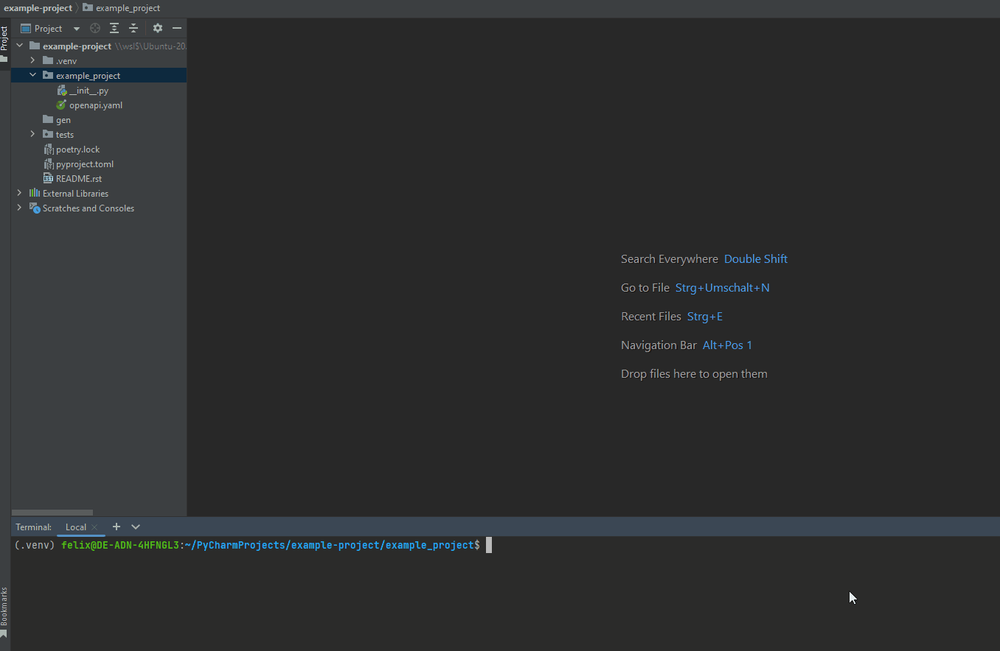

[](https://www.python.org/downloads/release/python-3100/)

[](https://github.com/psf/black)
[](https://pycqa.github.io/isort/)


# Openapi yaml file to FastApi Client
A commandline tool to generate Api `functions` and their required `pydantic Model` Schema from an `openapi.yaml` of version 3

## Installation
```shell
pip install openapi-fastapi-client
```

## Usage
```shell
openapi-fastapi-client ./openapi.yaml ./my-client
```
```shell
openapi-fastapi-client ./openapi.yaml ./my-client --async
```
- this will generate under the folder `my-client` following files
  - `__init__.py` if not exists
  - `api.py` here are all function calls to the external api
  - `schema.py` here are all pydantic Models
  

## Arguments
- `OPENAPI_FILE  [required]`
- `OUTPUT_PATH   [required]`

## Options
- `--sync`  All requests to the client are synchronous.  _default_
- `--async` All requests to the client are asynchronous with __aiohttp__.

## Help
```shell
openapi-fastapi-client --help
```


